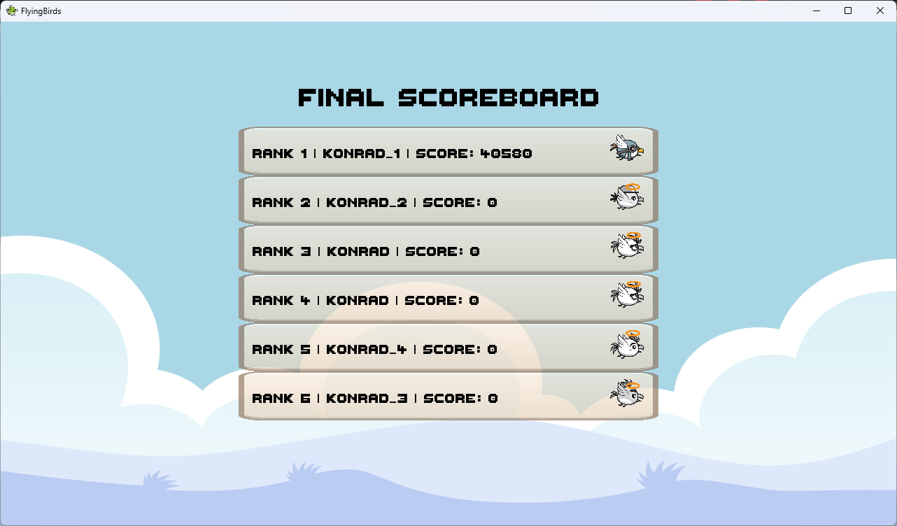

# FlyingBirds

<p align="center">
  
</p>

FlyingBirds is a client-server game that challenges user to code an **autonomous AI** for your own bird.

## Table of Contents

1. [Game Highlights](#game-highlights)  
2. [How It Works](#how-it-works)  
3. [Game Entities](#game-entities)  
4. [Getting Started](#getting-started)  
   1. [Starting the Server](#1-starting-the-server)  
   2. [Connecting the Client (GUI)](#2-connecting-the-client-gui)  

---

## Game Highlights

- **Control System**: Program your bird’s behavior using a Lua script.
- **Competitive Gameplay**: Absorb smaller players, avoid larger birds, and grab power-ups to stay alive.  
- **Power-Ups**: Power-Ups like Food, SpeedBoost, and Protection spawn around the map to help you grow stronger or survive.
- **Easy to Learn**: The simple concept (move and grow) hides a deep strategic layer via your custom code.

---

## How It Works

1. **Connect to the Server**  
   - Run or join a server, choose your nickname, and connect with the proper IP/Port.
<p align="center">
  
</p>

2. **Your Bird’s AI**  
   - Each game “tick”, you control your bird’s movement using Lua script by returning an angle (in degrees `0–360`) from a function called `getAngle(myId, players, entities)`.
   - Use `players` and `entities` tables to plan strategy:  
     - `players[id]` has fields like `.x`, `.y`, `.mass`, `.protection`, etc.  
     - `entities[id]` has fields like `.x`, `.y`, `.mass`, `.type` (e.g., `"food"`, `"speedboost"`, `"protection"`).
   - The server updates everyone’s positions and handles collisions.

Example of the simple strategy, seek the nearest entity:
```lua
    function getAngle(myId, players, entities)
        local myPlayer = players[myId]
        if not myPlayer then
            return 0
        end

        -- Example strategy: Seek the nearest food/power-up
        local myX, myY = myPlayer.x, myPlayer.y
        local closestId, closestDist2 = nil, math.huge

        for id, e in pairs(entities) do
            if e.type == "food" or e.type == "speedboost" or e.type == "protection" then
                local dx, dy = e.x - myX, e.y - myY
                local dist2 = dx*dx + dy*dy
                if dist2 < closestDist2 then
                    closestDist2 = dist2
                    closestId = id
                end
            end
        end

        if not closestId then
            return 0
        end

        local target = entities[closestId]
        local dx, dy = target.x - myX, target.y - myY
        local angleRadians = math.atan2(dy, dx)
        local angleDegrees = math.deg(angleRadians)

        return angleDegrees
    end
```

Try adding extra logic—like chasing smaller players or avoiding bigger ones—to make your AI more competitive!


3. **Growth and Survival**  
   - Collect **Food** to increase mass.  
   - Pick up **SpeedBoost** to temporarily move faster.  
   - Grab **Protection** to avoid being eaten by larger birds.  
   - *Watch out for bigger birds trying to absorb you!*
<p align="center">
  
</p>

4. **Victory Conditions**  
   - Survive until time runs out, or be the last bird standing.  
   - Larger mass = more points on the final scoreboard.
<p align="center">
  
</p>

---

## Game Entities

### Players (Birds)


| **Attribute**        | **Description**                                                                 |
|----------------------|---------------------------------------------------------------------------------|
| **Position (x, y)**  | Coordinates of the bird on the game map.                                        |
| **Mass**             | Represents your bird's size and health. Grow by eating food or smaller birds.   |
| **Speed**            | Movement speed, which can be boosted temporarily.                               |
| **Protection**       | Temporary shield that prevents being eaten by larger birds.                     |
| **Attacking**        | Indicates if the bird is currently absorbing a smaller bird.                    |

### Food


| **Attribute** | **Description**                                 |
|---------------|-------------------------------------------------|
| **Effect**    | Increases the mass of the bird that consumes it. |


### SpeedBoost


| **Attribute** | **Description**                                                           |
|---------------|---------------------------------------------------------------------------|
| **Effect**    | Provides a temporary speed multiplier, allowing your bird to move faster.|

### Protection


| **Attribute** | **Description**                                                                                                  |
|---------------|------------------------------------------------------------------------------------------------------------------|
| **Effect**    | Grants a shield that prevents your bird from being absorbed by larger birds for a limited duration.              |


---

## Getting Started

### 1. Starting the Server

1. Build the project or [download the latest release](https://github.com/konrad1s/FlyingBirds/releases/latest).
2. From the directory where the executable is located, run:
    ```bash
    ./server.exe
    ```
3. The server will open a console window and begin waiting for clients to connect. You can see log messages that indicate the server status.
4. To start the game, type `START`.

### 2. Connecting the Client

1. **Build the project** or **download the latest release**. Unfortunately, the assets are not publicly available in the repository, so the preferred option is to download the [latest release](https://github.com/konrad1s/FlyingBirds/releases/latest) or download the [assets](https://graphicriver.net/item/game-asset-flappy-rider-sprite-sheets/8105070) mannualy.

    ```bash
    ./client.exe
    ```

2. A window will appear with the main menu. You can enter the following details:
    - **Server IP**: e.g., `localhost`.
    - **Port**: Must match the server’s port (default is `12345`).
    - **Nickname**: Any name you’d like to appear in-game.

3. Click the **Play** or **Connect** button. If the connection is successful, you’ll be placed in the lobby state—waiting for the game to start.
4. Once enough players are connected (or the server admin starts the match), you’ll see your bird in the game world.
5. Your AI script (the `.lua` file) is automatically loaded by the client and used every game tick to control your movement.

---
